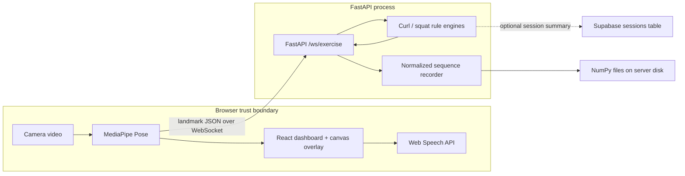

# AI Form Evaluator

**A browser-based coaching prototype that turns live pose landmarks into rep counts, form cues, and reusable training data.**

AI Form Evaluator is a local-first development project for experimenting with real-time squat and bicep-curl feedback. MediaPipe Pose runs in the browser, a FastAPI WebSocket service evaluates the resulting landmarks with explicit biomechanics rules, and a React dashboard shows progress, joint angles, and corrective cues. It is designed for developers and computer-vision practitioners exploring transparent exercise analysis—not as a medical device or a substitute for a qualified coach.

> **Prototype status:** the core feedback and recording paths work and are tested, but authentication, deployment hardening, reconnect behavior, and model validation are not yet complete.

## Why this project exists

Exercise-form systems can be difficult to inspect: a model emits a score, but the user cannot see why. This project keeps the live decision path deliberately legible. Rep transitions are based on joint-angle state machines, form faults must persist across multiple frames, and the UI overlays the active skeleton and angle so feedback can be traced to the signal that produced it.

The same interface can capture normalized, labeled landmark sequences. That connects an interactive coaching prototype to a practical data-collection workflow for future model experiments without recording raw camera frames on the server.

## How it works

1. Select **Bicep Curl** or **Squat** and allow browser camera access.
2. MediaPipe Pose estimates 33 landmarks in the browser; the raw video remains in the browser.
3. The client sends one landmark payload at a time over WebSocket. When multiple payloads queue, the server retains the newest landmark frame while preserving control messages.
4. Exercise-specific state machines calculate the active joint angle, rep progress, and debounced form feedback.
5. The dashboard renders the skeleton, announces counts or faults through the Web Speech API, and can save labeled, normalized landmark sequences as NumPy arrays.

## Capabilities

- **Inspectable live feedback:** overlays pose segments, active joint angles, visibility diagnostics, rep progress, and corrective cues on the camera view.
- **Exercise-specific state machines:** tracks right-arm flexion for curls and right-leg flexion for squats, including the complete up/down transition before reporting a full repetition.
- **Debounced fault detection:** requires five consecutive frames before reporting shoulder sway or knee cave, and counts a sustained fault as one incident until the signal clears.
- **Backpressure at the client and server:** the browser allows one outstanding landmark request, while the server drains queued messages and processes only the newest landmark payload.
- **Voice feedback:** uses the browser's speech synthesis to announce completed reps and new fault messages; it can be muted from the dashboard.
- **Labeled sequence recording:** records 15 selected landmarks, centers them on the hips, scales them by torso length, and saves 30-feature `float32` frames under the chosen exercise and label.
- **Optional session summaries:** writes rep, duration, and incident totals to a configured Supabase `sessions` table. The live coaching path still runs when Supabase is not configured.

## Architecture



The browser performs pose inference; the backend does **not** receive raw video through the application WebSocket. It receives landmark coordinates and visibility values. Each WebSocket connection owns independent exercise and recorder state, while recorded arrays are written to the backend filesystem. Session-summary persistence is a separate, optional Supabase path.

### Engineering decisions

- **Rules before opaque scores.** The active feedback loop uses deterministic angle thresholds and temporal guards. TensorFlow model wrappers and training scripts exist in the repository, but their inference calls are disabled in the live server and are not presented as active product features.
- **Torso-relative normalization.** Fault tolerances and recorded coordinates use torso length as a scale reference, reducing sensitivity to the user's distance from the camera.
- **Temporal hysteresis.** Five-frame activation and recovery windows reduce one-frame fault flicker; incident flags prevent a sustained fault from inflating session totals.
- **Newest-frame processing.** Landmark analysis favors current feedback over processing every stale observation. Control events such as exercise changes and recording commands are still applied in order.
- **Per-connection state.** Exercise counters and recording buffers are instantiated after WebSocket connection, avoiding shared rep state between concurrent clients in a single process.

## Quickstart

### Prerequisites

- Python 3.9 (the version used by the backend container)
- Node.js `^20.19.0` or `>=22.12.0` (required by Vite 7)
- npm
- A browser with camera access and Web Speech API support for voice cues
- Internet access on first load for MediaPipe model assets served from jsDelivr

Clone the canonical repository:

```bash
git clone https://github.com/harshvardhan579/form_eval_app.git
cd form_eval_app
```

Start the backend in the first terminal:

```bash
cd server
python3 -m venv .venv
source .venv/bin/activate
python -m pip install -r requirements.txt
python main.py
```

The API listens on `http://localhost:8000`; interactive API documentation is available at `http://localhost:8000/docs`.

Start the client in a second terminal:

```bash
cd client
npm ci
VITE_WS_URL=ws://localhost:8000 npm run dev
```

Open `http://localhost:5173`, grant camera access, keep your full body in frame, and complete a curl or squat. Stop either development server with <kbd>Ctrl</kbd>+<kbd>C</kbd>.

> **Privacy-critical local setting:** always set `VITE_WS_URL=ws://localhost:8000` for local-only evaluation. Without it, the current client falls back to the project's hosted WebSocket endpoint and transmits pose landmarks there.

### Configuration

| Variable | Required | Purpose |
| --- | --- | --- |
| `VITE_WS_URL` | Yes for local/private use | WebSocket origin used by the browser client. Use `ws://localhost:8000` for the local backend. |
| `PORT` | No | Backend port; defaults to `8000`. Keep `VITE_WS_URL` in sync if changed. |
| `SUPABASE_URL` | No | Supabase project URL for session summaries. |
| `SUPABASE_KEY` | No | Supabase credential used by the backend. Keep it server-side and out of source control. |

Create `server/.env` only if optional Supabase persistence is needed. No Supabase migration or table definition is included, so that integration requires an existing compatible `sessions` table. With no Supabase configuration, session writes are skipped and `GET /api/sessions` returns an empty list.

## Recording a training sequence

1. Choose the exercise and a **Perfect** or **Flawed** label.
2. Select **Record set** and wait for the three-second countdown.
3. Perform the movement, then select **Stop & save**.
4. Find the generated array at:

```text
server/data/training_data/<label>/<exercise>/<timestamp>.npy
```

Each row contains normalized `x` and `y` values for 15 selected landmarks, producing a shape of `(frames, 30)` with `float32` values. **Trash** cancels the active recording and clears its in-memory buffer without writing a file.

## Interface reference

| Interface | Direction | Purpose |
| --- | --- | --- |
| `WS /ws/exercise` | Bidirectional | Accepts landmarks and control messages; returns reps, progress, feedback, active angle, and joint coordinates. |
| `GET /api/sessions` | Client → server | Returns up to 10 recent Supabase session summaries, or `[]` when persistence is unavailable. |
| `set_exercise` | Client → WebSocket | Switches between `Bicep Curl` and `Squat` and resets the selected exercise state. |
| `reset` | Client → WebSocket | Resets the current in-memory rep state. |
| `recording_control` | Client → WebSocket | Starts, stops, saves, or cancels a labeled landmark recording. |

FastAPI also exposes generated OpenAPI documentation for the HTTP surface at `/docs`. The WebSocket message schema is currently enforced by application code rather than a published schema.

## Tech stack

| Layer | Technology | Role |
| --- | --- | --- |
| Client | React 19.2, Vite 7.3 | Dashboard, application state, and development/build tooling |
| Pose estimation | MediaPipe Pose 0.5 | Browser-side landmark extraction |
| Visualization | HTML canvas, React Resizable Panels 4.10 | Skeleton overlays and panel-based workspace |
| Transport/API | WebSocket, FastAPI, Uvicorn | Live landmark/control exchange and session HTTP endpoint |
| Analysis | Python, NumPy | Rule evaluation and normalized sequence generation |
| Persistence | NumPy files; optional Supabase | Training sequences and session summaries |
| Quality | pytest, ESLint | Backend behavior tests and frontend static analysis |

Dependency versions above reflect the committed npm lockfile and pinned MediaPipe Python requirement. Most Python dependencies are not pinned, so backend installs are not fully reproducible yet.

## Testing and quality

Backend tests cover fault debouncing, incident reset behavior, recorder lifecycle, file shape, and cancellation. `pytest` is not currently part of `server/requirements.txt`, so install it separately in the development environment:

```bash
cd server
source .venv/bin/activate
python -m pip install pytest
PYTHONPATH=. python -m pytest
```

Run the frontend checks from `client/`:

```bash
npm run lint
npm run build
```

Current verification on this revision:

- Backend: 13 tests passed.
- Frontend: ESLint completed with no errors.
- Frontend: Vite production build completed successfully (40 modules transformed).
- API smoke test: the server started on a temporary port and `GET /api/sessions` returned `200 OK` with `[]` when session persistence was unavailable.

## Security, privacy, and trust model

- **Camera boundary:** raw camera frames are rendered and processed in the browser. The application WebSocket sends derived pose landmarks, which can still describe body movement and should be treated as sensitive data.
- **Backend selection:** the client has a hosted fallback. Set `VITE_WS_URL` explicitly before using the camera when landmark data must remain on infrastructure you control.
- **Network exposure:** the backend binds to `0.0.0.0`, has no authentication or authorization, and permits all CORS origins. Do not expose it directly to an untrusted network.
- **Untrusted recording controls:** WebSocket clients can supply exercise and label values used in recording paths, and the current sanitization only replaces spaces. Run the service only with trusted clients until input validation prevents path traversal.
- **Local files:** labeled landmark recordings are unencrypted `.npy` files on the server filesystem. The project does not implement retention, access control, backups, or secure deletion.
- **Optional external storage:** when Supabase credentials are configured, exercise type, rep count, duration, and fault-incident totals are sent to that project. Raw landmarks are not written through `DBManager`.
- **Third-party assets:** the browser downloads MediaPipe model assets from jsDelivr at runtime.
- **Secrets:** `.env` files are ignored by Git. Never place service-role credentials in client-side `VITE_*` variables, because Vite embeds them in browser code.

There is no dedicated security-reporting policy in the repository.

## Deployment and operations

The supported path is local development. `server/Dockerfile` can package the backend and honors `PORT`, but there is no frontend container, Compose file, health/readiness endpoint, TLS termination, migration workflow, or documented backup strategy. Treat hosted deployment as experimental and place authentication, rate limiting, TLS, and origin controls in front of the service.

Recorded sequences rely on local filesystem persistence. Container deployments need an explicit persistent volume if recordings must survive replacement. Supabase session writes fail soft: the coaching loop continues, but persistence errors are logged rather than surfaced to the client.

## Project structure

```text
client/src/                 React dashboard, camera pipeline, and recorder UI
server/main.py              FastAPI HTTP and WebSocket entry point
server/core/                Active rule-based exercise analysis
server/services/            Landmark normalization and recording services
server/db/                  Optional Supabase session adapter
server/tests/               Rule-debounce and recorder unit tests
server/models/              Experimental model wrappers (not active at runtime)
server/scripts/             Offline extraction, training, and evaluation tools
server/rag/                 Disconnected RAG experiment, not used by the app
main.py                     Legacy Tkinter/OpenCV application
```

Large datasets, generated training data, model weights, and virtual environments are excluded by `.gitignore` and are not prerequisites for the live rule-based path.

## Limitations

- Supports only squats and right-arm bicep curls, using fixed rule thresholds rather than personalized calibration.
- Evaluates a 2D landmark projection and depends on camera angle, lighting, visibility, and MediaPipe tracking quality.
- Provides coaching cues for experimentation; it has not been clinically validated and must not be used for diagnosis, rehabilitation decisions, or injury prevention claims.
- Has no authentication, WebSocket reconnect strategy, formal message schema, rate limiting, or multi-process coordination.
- The resizable-panel integration uses props that do not match the installed v4 API, so the current dashboard layout can render incorrectly until that UI compatibility issue is fixed.
- Stores recordings on one backend filesystem; durability and cross-instance sharing are not provided.
- Optional Supabase persistence lacks a committed schema or migration.
- Experimental neural-network and retrieval-augmented generation code is disconnected from the live application.
- The backend dependency set is mostly unpinned, and CI is not configured in this repository.
- No license file is present, so reuse rights are not granted by the repository as it stands.

## Contributing

There is not yet a dedicated contributing guide. For a change, run the backend tests plus the frontend lint and build commands above, keep the live feedback path explainable, and avoid committing captured recordings, datasets, model weights, or secrets.
